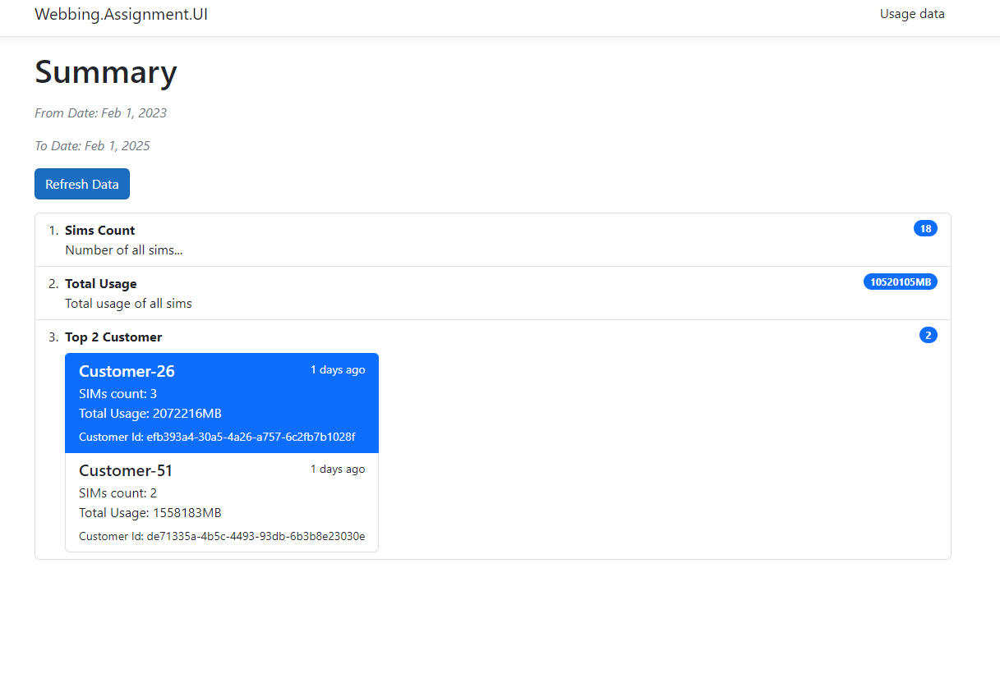
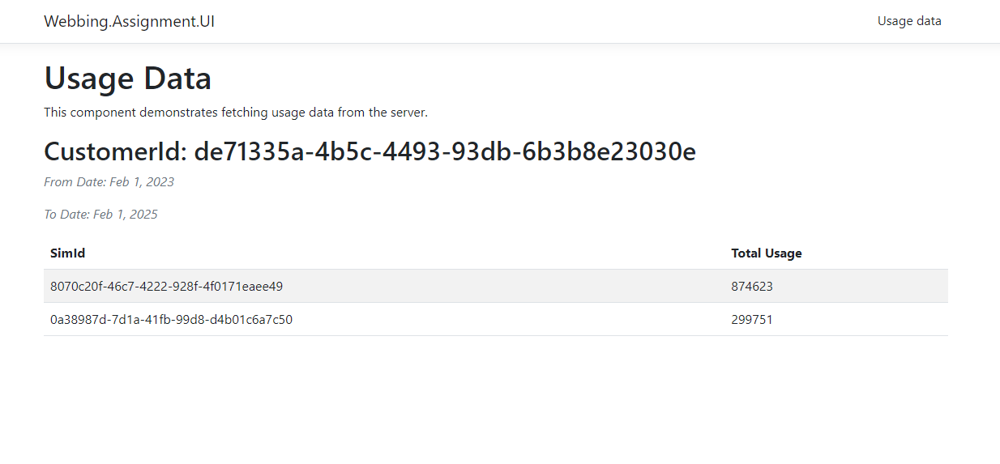

### Solution Approach
This solution leverages a event streaming architecture.

### Here's a breakdown of the key components:

- I utilize the Consumers and Partitioning concept from frameworks like Apache Kafka.
- Each service instance has one network event consumer 
- Each consumer is responsible for processing events based on its assigned partition index or key. 
- This approach allows us to scale by adding additional service instances for more efficient event consumption. 

Here's how to determine the partition for each NetworkEvent based on SIM ID hash:

1. Partitioning Logic within Event Processor:
   Within the EventProcessor of each consumer:
   Extract the SIMIdentifier from the NetworkEvent.
   Calculating the partition index using a hashing function like (SimId.GetHashCode() % partitions).

2. NetworkEvent Consumers Configuration:

```
"NetworkEvent": {
    "Consumers": {
        "PartitionIndex": 0,            // Current partition this service instance is consuming from (internal)
        "Partitions": 1,                // Total number of partitions for network events
        "PeriodInMilliseconds": 1000,   // Delay between processing events (milliseconds)
        "ThresholdTimeInHours": 24,     // Maximum time window (hours) to process historical data
        "ProcessLimit": 200             // Maximum number of events to process per consumer execution
    }
}
```

* The usage entity/data can be persisted in non-relational databases, like MongoDB. 
This specifically configured for read-heavy workloads to optimize performance for retrieving usage reports.






